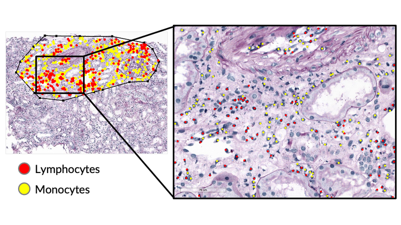
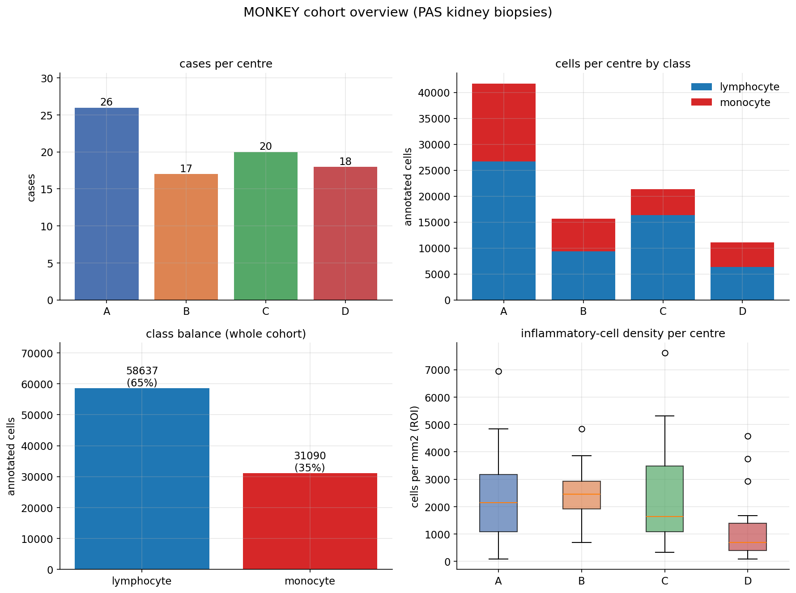
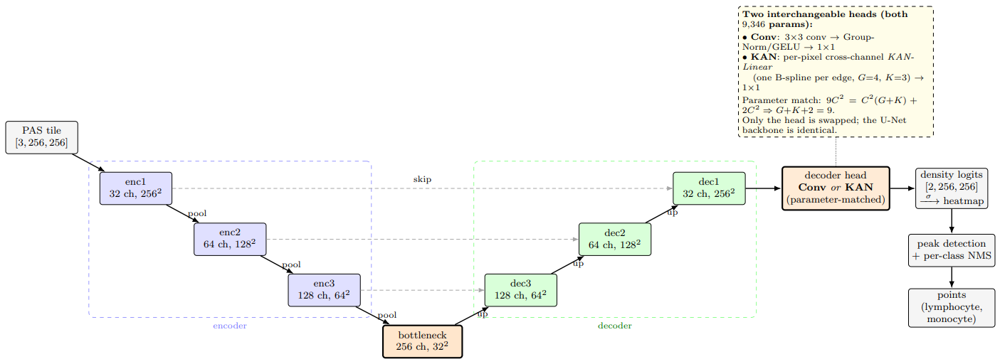
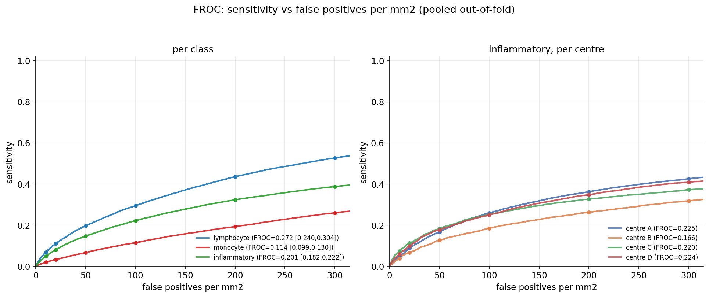
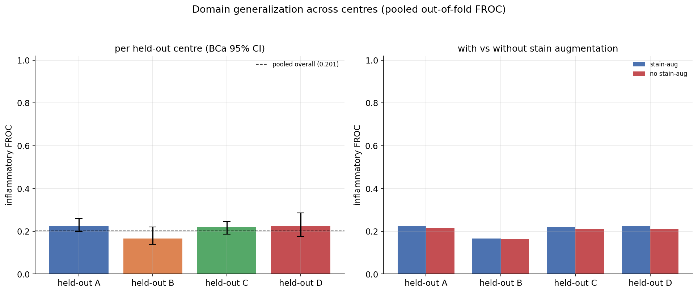
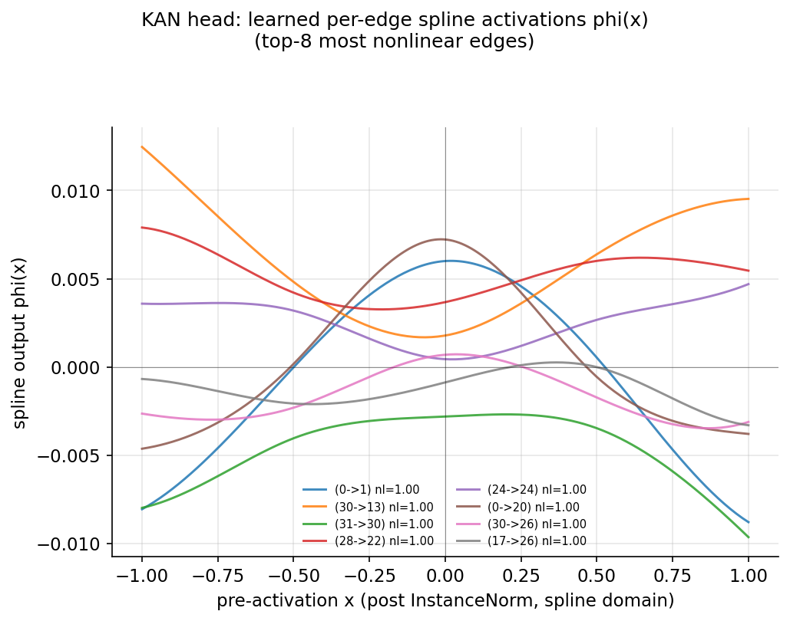

# The MONKEY challenge: Machine-learning for Optimal detection of iNflammatory cells in KidnEY transplant biopsies

Detection and classification of inflammatory cells (lymphocytes and monocytes)
in multi-centre PAS-stained kidney-transplant biopsies, for the MONKEY
benchmark. A compact 2D U-Net regresses per-class density maps from dot
annotations; local-maxima peak detection turns the maps into predicted cell
locations. Scoring uses patient-level, leave-one-centre-out splits, so every
reported number reflects performance on centres the model never trained on.

Automated inflammatory-cell counting matters for the Banff classification of
transplant biopsies, where several lesion scores depend on how many lymphocytes
and monocytes sit in each kidney compartment; today this is read by hand, which
is slow and subjective.

This repository also continues the thesis line of work on Kolmogorov-Arnold
Networks (KANs) for medical imaging: the U-Net decoder head can be a plain
convolution or a parameter-matched KAN layer, so the two can be compared fairly
on a real 2D detection task.

## Dataset

The MONKEY training set is a multi-centre cohort of PAS-stained kidney
transplant biopsies with dot annotations for two inflammatory-cell types. The
annotations were guided by an immunohistochemistry (IHC) re-stain of the same
slide (CD3/CD20 for lymphocytes, PU.1 for monocytes); the IHC is used only to
place the dots and is **never** a model input - only the PAS scan is.

The packed cohort used here is 81 cases across 4 centres (A-D) with 89,727
annotated cells, class-imbalanced toward lymphocytes (65%) over monocytes (35%);
cell density per ROI varies markedly between centres, which is what makes the
leave-one-centre-out setup a genuine generalization test.

<p>


</p>

*Top: an annotated ROI (red = lymphocytes, yellow = monocytes) with a zoomed
PAS view — source: [monkey.grand-challenge.org/dataset](https://monkey.grand-challenge.org/dataset/).

Bottom: cohort composition from `results/eda_summary.json`.*

- Dataset (AWS Marketplace): <https://aws.amazon.com/marketplace/pp/prodview-r2b3mcqqaijge>
- Challenge: <https://monkey.grand-challenge.org/>

## Target

The challenge defines two tasks, and this repository addresses both:

- **Task 1 - inflammatory-cell detection:** find mononuclear leukocytes (MNLs)
  without distinguishing the subtype (lymphocytes and monocytes pooled into one
  "inflammatory" class).
- **Task 2 - subtype detection:** detect and separate the two subtypes,
  lymphocytes and monocytes.

The model emits one density channel per subtype; the combined inflammatory
prediction is obtained from the union of the two, so a single trained model
covers both tasks.

## Preprocessing

Whole-slide images are tiled offline (no GPU) into 256×256 patches at a target
resolution of 0.5 µm/px, keeping only tiles that overlap an annotated ROI. Each
tile carries its ROI mask, so pixels outside the annotated region never
contribute to the loss or the score, and white background inside a ROI is a true
negative. Dot annotations are stored per tile and splatted into a small Gaussian
density target at training time. Only the PAS CPG scan is packed; raw slides
never leave the download machine. The model input is the RGB PAS tile
(ImageNet-normalised); the packed per-case HDF5 files are the only thing the
training and evaluation code reads.

## Architecture

<p></p>

A three-stage 2D U-Net (channels 32→64→128, a 256-channel bottleneck, and a
mirrored decoder with skip connections; GroupNorm + GELU throughout) emits two
density-logit channels. The sigmoid of that map is read by local-maxima peak
detection with per-class non-maximum suppression, and peaks are mapped back to
level-0 slide coordinates.

The only interchangeable part is the **decoder head**:

- **conv:** a 3×3 convolution → GroupNorm/GELU → 1×1 projection;
- **KAN:** a per-pixel cross-channel `KANLinear` (one learnable B-spline per
  input/output channel edge, grid size 4, spline order 3) → 1×1 projection.

The two heads are parameter-matched by construction - a 3×3 conv holds `9·C²`
weights and the KAN head holds `C²·(G+K) + 2·C²`, so `G+K+2 = 9` makes them
equal - which is what allows an honest conv-vs-KAN comparison where only the
mechanism changes, not the capacity.

| Parameter group | Count | Share |
|---|---|---|
| Total (U-Net + head) | 1,957,602 | — |
| Decoder head (conv or KAN) | 9,346 | 0.48% |
| Genuine-KAN (spline weight + scaler) | 8,192 | 0.42% |

Relative to the 3D segmentation thesis (B-spline and Fourier KAN sites plus a
YOTO/FiLM conditioner in a 3D U-Net), this is a deliberately smaller design: a
single B-spline KAN layer as the decoder head of a 2D detection network. The
question is the same - does a KAN site earn its place next to a
parameter-matched convolution - but the setting is 2D point detection rather
than 3D segmentation.

## Metrics

- **FROC (Free-Response ROC) score** - the challenge ranking metric. Sensitivity
  (recall) is measured at six allowed false-positive densities, FP/mm² ∈
  {10, 20, 50, 100, 200, 300}, and the FROC score is the mean sensitivity over
  those six points. A prediction is a true positive if its centre lies within
  the class radius of a ground-truth dot (4 µm lymphocyte, 5 µm monocyte, 5 µm
  combined), matched nearest-neighbour. With TP, FP, FN counted this way,
  sensitivity = TP / (TP + FN) and false positives are normalised by the scored
  ROI area (FP/mm²).
- **Precision / recall at fixed score thresholds** (0.4 and 0.9): precision =
  TP / (TP + FP), recall = TP / (TP + FN), and F1 = 2·P·R / (P + R). The high
  threshold (0.9) trades recall for precision; the low one (0.4) does the
  opposite.

This mirrors the official MONKEY evaluation (nearest-neighbour matching, MONAI
FROC, the same radii and FP points).

## Results

Training is leave-one-centre-out: four folds, each holding out one centre for
validation and training on the other three, with per-epoch checkpoint/resume,
ROI-masked foreground-weighted loss, and stain/geometric augmentation on the
train folds only. Every case is then scored by the fold that never saw its
centre, and the per-case matches are pooled before computing FROC - so the
headline is an out-of-fold, unseen-centre estimate, not a per-fold best.

The table is the main model (convolutional head, stain augmentation), pooled
out-of-fold with BCa 95% confidence intervals (2000 resamples); all values come
from `results/metrics.json`.

| Class | FROC | 95% CI | SD | P@0.4 | R@0.4 | P@0.9 | R@0.9 |
|---|---|---|---|---|---|---|---|
| Lymphocyte | 0.272 | [0.240, 0.304] | 0.016 | 0.428 | 0.771 | 0.730 | 0.394 |
| Monocyte | 0.114 | [0.099, 0.130] | 0.008 | 0.234 | 0.584 | 0.649 | 0.002 |
| Inflammatory (combined) | 0.201 | [0.182, 0.222] | 0.011 | 0.385 | 0.786 | 0.768 | 0.271 |

<p></p>

Reading the numbers honestly:

- Lymphocytes, the majority class, are detected best; monocytes are much harder
  (rarer, and near-zero recall at the strict 0.9 threshold), which drags the
  combined score down.
- Generalization is even across centres (per-centre inflammatory FROC 0.17–0.23,
  overlapping CIs), so no single centre dominates the result.
- For context only, the challenge winner KongNet reports ~0.393 inflammatory and
  ~0.462 lymphocyte FROC. Those are on the **closed test set from a separate
  institution**, not this internal leave-one-centre-out split of the public
  training set, so the two are not directly comparable and this is not a
  leaderboard submission. This repository is a compact ~2M-parameter baseline
  built for a controlled architecture study under a small compute budget, not a
  tuned challenge entry.

## Ablations

Two ablations were run, each scored the same pooled out-of-fold way and written
to its own metrics file. Both keep the exact backbone; only one factor changes.

**Stain augmentation** (`metrics.json` vs `metrics_noaug.json`): HED stain
jitter on the train folds did not improve cross-centre generalization on this
cohort - the combined score is unchanged and the per-class effect is within
noise.

**Decoder head, conv vs parameter-matched KAN** (`metrics.json` vs
`metrics_kan.json`): the convolution is at least as good as the KAN on every
class.

| Inflammatory FROC | Conv (aug) | KAN (aug) | Conv, no aug |
|---|---|---|---|
| Combined | **0.201** [0.182, 0.222] | 0.171 [0.149, 0.194] | 0.202 [0.182, 0.224] |
| Lymphocyte | **0.272** | 0.232 | 0.283 |
| Monocyte | **0.114** | 0.100 | 0.104 |

<p></p>

The parameter-matched KAN head does not beat the convolution here. This is the
same conclusion the thesis reached in 3D segmentation, now reproduced on a 2D
detection task: under a fixed parameter budget the KAN site does not add
measurable detection quality. Its value, if any, is interpretability.

## Interpretability

Unlike a convolution filter, each KAN edge is a univariate spline that can be
plotted and read directly. Reading the trained `kan_aug` head
(`results/kan_interpretability_summary.json`):

- The head genuinely uses its nonlinearity: across all 1,024 edges (32×32),
  **0% are near-linear** (nonlinearity < 0.1) and the median per-edge
  nonlinearity is **0.75** on a 0 (linear) to 1 (strongly nonlinear) scale, so
  the splines do not collapse to straight lines.
- The spline-path gain is modest but non-trivial (mean |spline scaler| ≈ 0.12),
  spread across many edges rather than a few dominant ones.
- The per-edge curves are smooth and diverse (monotone, U-shaped, S-shaped),
  which is exactly the transparency a convolution cannot offer.
- Honest caveat: this readability does **not** translate into a detection gain -
  the KAN head scores below the convolution above - so here interpretability is
  the feature, not accuracy.

<p></p>

## Conclusion

- A compact 2D U-Net density detector generalizes evenly across the four centres
  under leave-one-centre-out scoring; lymphocytes are detected reliably,
  monocytes remain the hard, rare class.
- Stain augmentation did not help cross-centre generalization on this cohort.
- The parameter-matched KAN decoder head did not beat the convolution on any
  class; its contribution is interpretable per-edge splines, not detection
  quality - consistent with the thesis finding in 3D segmentation.
- The dataset scale, parameter envelope, and modest scores follow from the
  available compute budget rather than from an architectural preference; the
  point of the repository is a fair, reproducible comparison, not a leaderboard
  ranking.

## Technology stack

| Tool | Role |
|---|---|
| Python 3.10+ | Runtime |
| PyTorch | Model, training, and inference |
| NumPy | Array handling |
| SciPy | Peak detection (maximum filter) and BCa bootstrap |
| h5py | Packed per-case HDF5 I/O |
| tqdm | Progress bars |
| Matplotlib | Result and interpretability figures |
| pytest | Offline unit tests |
| Ruff | Linting |
| Docker | Containerised smoke run |
| GitHub Actions | CI (Ruff and pytest, CPU) |

## Project structure

```
src/monkey/   package (config, data, targets, model, kan, train, detect,
              froc, metrics, evaluate, checkpoint, cli)
tests/        offline, deterministic CPU tests (no data, weights, or GPU)
scripts/      figure scripts (EDA, FROC, domain generalization, detection,
              KAN interpretability) + shared style
results/      slim metrics (conv / no-aug / KAN), EDA & KAN summaries, figures/
docs/         README figures (architecture schema, annotation example)
notebooks/    Colab notebook (install, train, detect, out-of-fold, figures)
```

Full-size `metrics*.json` (with the per-point FROC/PR/calibration arrays) are
kept out of the repository; the committed files retain every headline number.

## Development

```bash
pip install -e ".[dev]"
ruff check src tests
pytest
```

CI runs Ruff and pytest on Python 3.10 and 3.12, CPU-only, with no data and no
weights.

## How to run

### Quick check (no data, no weights)

```bash
pip install torch==2.6.0 --index-url https://download.pytorch.org/whl/cpu
pip install -e ".[dev]"
monkey smoke
```

`smoke` runs a random tensor through both decoder heads and prints the output
shape and parameter counts. This is what CI runs.

### Colab (full run)

`notebooks/monkey_colab.ipynb` runs the whole pipeline: install from GitHub,
train the four leave-one-centre-out folds (plus the KAN and no-aug ablations),
detect, score out-of-fold into `metrics.json` / `metrics_noaug.json` /
`metrics_kan.json`, and regenerate every figure. Data and checkpoints live on
your own Google Drive; raw slides are never uploaded.

### CLI

```bash
export MONKEY_DATA_DIR=/path/to/packed/monkey     # per-case <case>.h5
export MONKEY_CKPT_DIR=/path/to/checkpoints        # fold_{i}_{tag}.pt
export MONKEY_RESULTS_DIR=/path/to/results

monkey train  --device cuda                        # all four LOCO folds
monkey detect --case "$MONKEY_DATA_DIR/A_P000001.h5" --fold 1 --device cuda
monkey oof    --device cuda --out "$MONKEY_RESULTS_DIR/metrics.json"
monkey figures --out "$MONKEY_RESULTS_DIR"

# Ablations select their own checkpoint tag via environment flags:
MONKEY_HEAD=kan        monkey oof --device cuda --out "$MONKEY_RESULTS_DIR/metrics_kan.json"
MONKEY_USE_STAIN_AUG=0 monkey oof --device cuda --out "$MONKEY_RESULTS_DIR/metrics_noaug.json"
```

### Docker

```bash
docker build -t monkey .
docker run --rm monkey
```

The image installs the package with a CPU build of PyTorch and defaults to
`monkey smoke`. Mount data and weights and append a command to run more.

## License

MIT — see [LICENSE](LICENSE).

## References

1. Z. Liu, Y. Wang, S. Vaidya, et al. "KAN: Kolmogorov-Arnold Networks." arXiv:2404.19756, 2024.
2. Blealtan. "efficient-kan." GitHub repository, 2024. <https://github.com/Blealtan/efficient-kan>
3. MONKEY Challenge: Machine-learning for Optimal detection of iNflammatory cells in the KidnEY. Grand Challenge, <https://monkey.grand-challenge.org/>.
4. J. Lv, E. S. Nasir, K. Xu, M. Jahanifar, et al. "KongNet: A Multi-headed Deep Learning Model for Detection and Classification of Nuclei in Histopathology Images." arXiv:2510.23559, 2025.
5. O. Ronneberger, P. Fischer, and T. Brox. "U-Net: Convolutional Networks for Biomedical Image Segmentation." MICCAI, 2015. arXiv:1505.04597.
6. Y. Wu and K. He. "Group Normalization." ECCV, 2018. arXiv:1803.08494.
